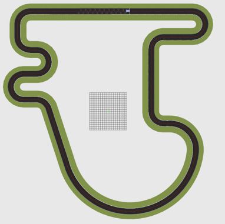

# 🛞 Ackermann Line Following Robot with PS4 Manual Control

This project presents a line-following robot with an Ackermann steering configuration, developed entirely using **ROS 2**. The robot is capable of autonomous navigation following a predefined path and can also be manually controlled using a **PlayStation 4 controller** for testing or override purposes.

## 🚗 Features

- Line following using camera-based path detection.
- Ackermann steering for realistic car-like dynamics.
- Manual override using a PlayStation 4 controller via ROS 2 Joy node.
- Fully integrated into the ROS 2 ecosystem (nodes, topics, launch files).
- Real-world map used for testing included as an image.
- Compatible with simulation and real deployment.

## 🧠 Technologies Used

- **ROS 2 (Humble/Foxy)** – Robot operating system.
- **OpenCV** – For line detection and image processing.
- **Ackermann_msgs** – ROS 2 messages for steering control.
- **joy + teleop_twist_joy** – For PS4 controller support.
- **rviz** – Visualization and debugging.

## 🗺️ Map

The map used for line following is shown below:



## 🎮 Manual Control

The robot can be driven manually using a PlayStation 4 controller, mapped through the `joy` and `teleop_twist_joy` ROS 2 packages. You can switch between manual and autonomous modes easily during runtime.

## 📹 Videos

### 🔁 Ackermann Movement

<video width="100%" controls>
  <source src="Video1.mpg" type="video/mp4">
  Your browser does not support the video tag.
</video>

### 🎮 Manual Control with PS4 Controller

<video width="100%" controls>
  <source src="Video2.mp4" type="video/mp4">
  Your browser does not support the video tag.
</video>


## 🚀 How to Run

```bash
# Clone the repository and source your ROS 2 workspace
cd ~/ros2_ws/src
git clone https://github.com/yourusername/ackermann-line-follower.git
cd ~/ros2_ws
colcon build
source install/setup.bash

# Launch autonomous mode
ros2 launch ackermann_line_follower autonomous.launch.py

# Or launch manual mode with PS4 controller
ros2 launch ackermann_line_follower manual.launch.py
```

## 👨‍💻 Authors

**Héctor Gordillo**  
---

📌 *This project is part of an academic robotics assignment focused on ROS 2-based control and Ackermann kinematics.*
